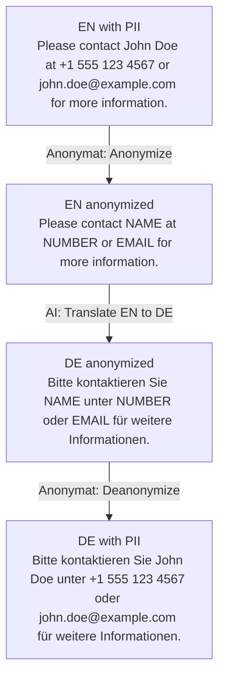

# Anonymat
 
# Local Text Anonymizer  

## Description  
**Local Text Anonymizer** fills a gap for professional environments where the use of AI tools for text translation, correction, or improvement is severely limited by data protection regulations.  
This lightweight, browser-based tool enables semi-automated anonymization of sensitive text, making it safe to use with external AI APIs — and just as easily allows re-identification of the text afterward.  

The tool runs as a single HTML file directly in the browser on almost any office machine.  
A simple, clean user interface ensures anonymization can be done with minimal effort and time.  

> Important: This is a partial automation tool. Final responsibility for proper anonymization remains with the user.  
> Detection is intentionally simple and purely pattern-based. Expect incomplete and sometimes incorrect matches — this is a helper for local pre-processing, not a guaranteed anonymization service.  

---

## Key Features  
- Detects and anonymizes:  
  - Names  
  - Email addresses  
  - Phone numbers  
  - IBANs  
- Fully local execution (no data leaves your device)  
- GDPR-compliant workflow  
  > *GDPR (General Data Protection Regulation) is an EU law enforcing strict privacy and data protection standards.*  
- Easy deanonymization for re-importing edited texts  
- Designed for professional use cases in regulated environments  
- Zero installation: runs as a single file in any modern browser  
- Minimal, distraction-free interface  

---

## Example: Anonymize Before Using AI  
1. Original text:  
   `Please contact John Doe at +1 555 123 4567 or john.doe@example.com for more information.`  
2. In Anonymat, click `Anonymize` → for example:  
   `Please contact [Name] at [Number] or [Email] for more information.`  
3. Send this anonymized sentence to an AI system (e.g. for translation or rewriting).  
4. Paste the AI output back into Anonymat and click `Deanonymize` to restore the original name, phone number, and email locally.  

---

## Use Cases  
- Anonymize internal or client texts before sending them to AI tools for translation, correction, or summarization  
- Temporarily remove personal identifiers from reports or documentation for external review  
- Prepare text content for any scenario where privacy must be ensured  

---

## Why GDPR-compliant?  
All processing happens in your browser, offline, without external servers.  
This ensures that the tool can be used within GDPR-regulated environments and respects strict corporate privacy policies.  

---

## How It Works  
1. Download the file `dist/anonymat-<version>.html` and open the HTML file in your browser.  
2. Paste or type the text.  
3. Click `Anonymize` — detected personal data will be replaced by placeholders.  
4. Edit or process the anonymized text in external tools.  
5. Paste the processed text back into the tool and click `Deanonymize` to restore the original data.  

---

## Limitations  
- The tool provides **semi-automated** anonymization;  
- Complex text structures or unusual data formats might not be detected automatically.  
- **The final responsibility for checking and verifying the anonymized text lies with the user.**  

---

## Browser Support & Privacy
- Requires a modern browser with ES2018+ regex support (lookbehind, Unicode classes). Tested on recent Chrome/Edge/Firefox; Safari 16+ recommended.
- Everything runs locally; no network requests are made. The app stores language preferences in a short-lived `AppConfig` cookie and sets no telemetry.

---

## Contributing  
Suggestions and pull requests are welcome!  
Please open an issue before making significant changes.  

---

## License  
GPL V.3.0
